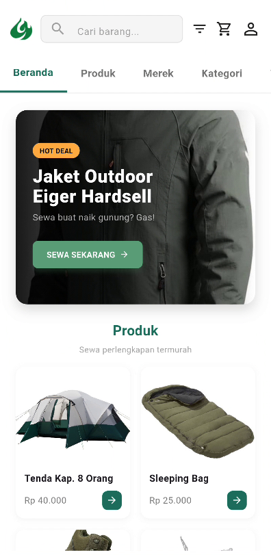
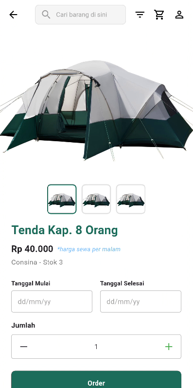

# ⛺ Camplify - Camping & Adventure App

**Camplify** adalah aplikasi mobile yang dirancang untuk mempermudah penyewaan peralatan camping dan reservasi tempat perkemahan. Repository ini berisi implementasi **Frontend (User Interface)** yang dikembangkan menggunakan **Flutter**.

Proyek ini mencakup slicing UI untuk dua role pengguna: **Customer** (Penyewa) dan **Merchant** (Penyedia).

---

## 📸 Tampilan Aplikasi (UI Slicing)

Berikut adalah hasil implementasi antarmuka yang telah dikerjakan:

| Role Selection | Dashboard Utama | Detail Produk |
|:---:|:---:|:---:|
|  |  |  |

*(Gambar di atas menunjukkan alur utama aplikasi dari login hingga pemesanan)*

---

## 📱 Tech Stack
* **Framework:** Flutter (Dart)
* **Architecture:** Modular Clean Structure
* **Scope:** Frontend UI Slicing & Mock Data Integration

## ✨ Fitur Utama

### 👤 Customer Side
* **Onboarding:** Splash screen & Role Selection.
* **Discovery:** Pencarian tempat camping, filter kategori, dan rekomendasi.
* **Transaksi:** Keranjang (Cart), Checkout UI, dan Status Pesanan.
* **Profil:** Manajemen biodata dan dokumen pengguna.

### 🏪 Merchant Side
* **Kelola Toko:** Dashboard merchant dan registrasi layanan.

---

## 📂 Struktur Project
Kode disusun secara modular agar mudah dikembangkan: